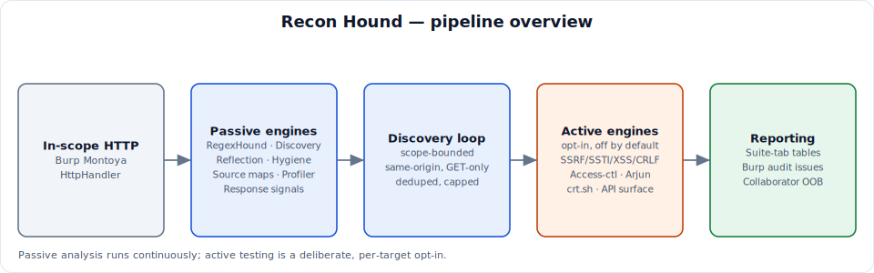
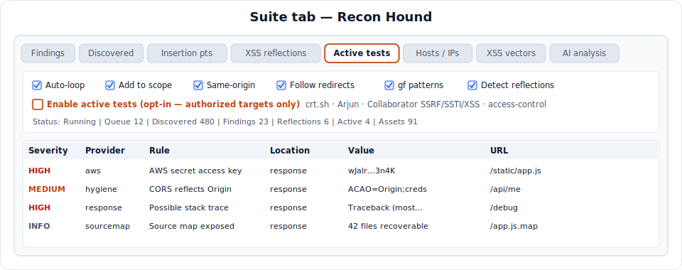
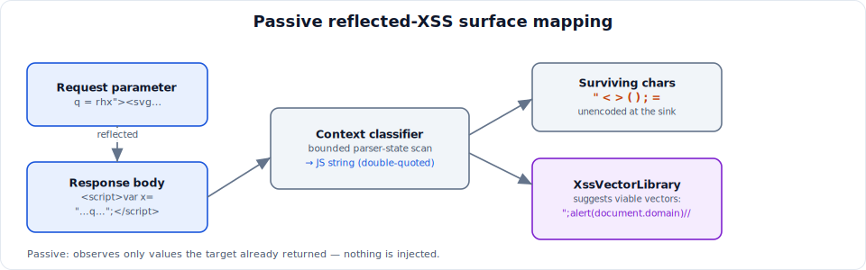
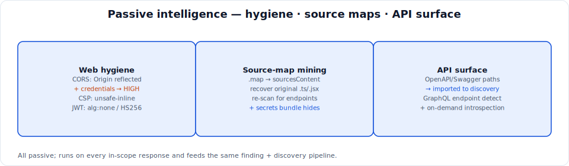
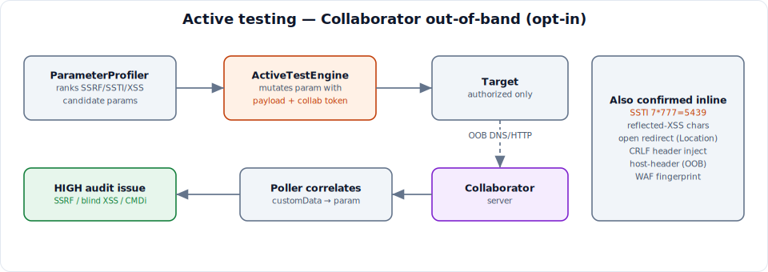
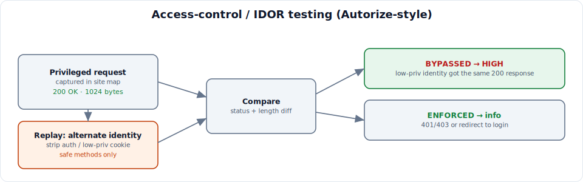
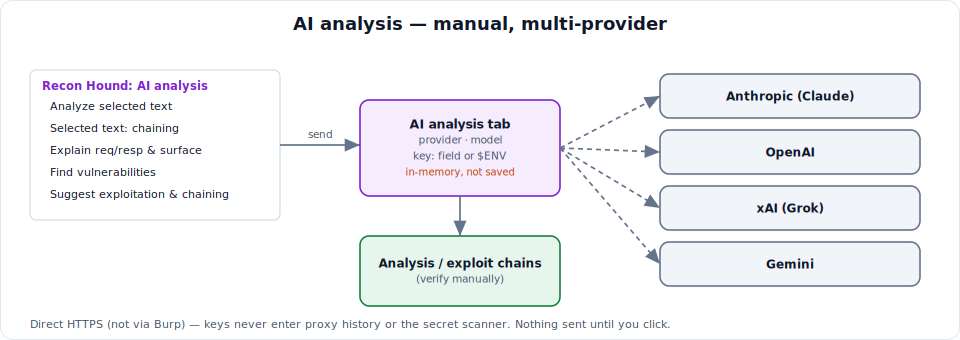
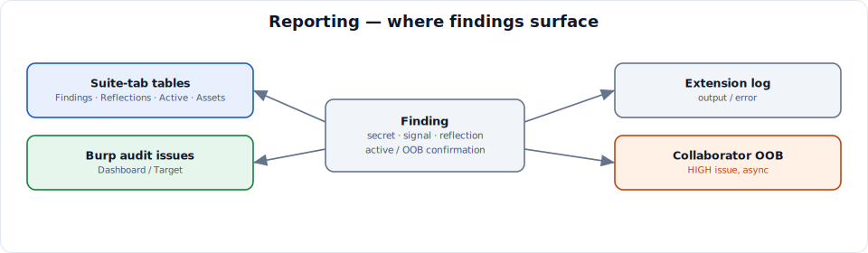

# Recon Hound — Burp Suite Professional extension (Montoya)

[](https://github.com/MKlolbullen/burpaderp/actions/workflows/ci.yml)
[](https://github.com/MKlolbullen/burpaderp/actions/workflows/release.yml)

Recon Hound is a scope-bounded asset, attack-surface, and content-intelligence extension for
Burp Suite Professional, written against the **Montoya API** and Java 21.

It is the successor to the original Recon Loop tooling. The earlier tooling was constrained by the
legacy Burp Extender API on **Jython (Python 2)** — end-of-life, no modern language features, awkward
threading, and no access to the current Montoya extension model. This version drops that constraint
entirely: it is a native Java extension with no Python runtime, so it runs on Burp's own JVM with
full access to the modern HTTP handler, site map, scope, scanner-issue, and UI APIs.

## What it does





- Watches in-scope HTTP requests and responses through a Montoya `HttpHandler`.
- Scans request + response content with the Java `RegexHound` port (secrets, tokens, keys, PEM
  material, cloud credentials, provider-specific patterns, JWTs, and more, with entropy gating and
  placeholder suppression).
- Optionally loads normal `gf` JSON packs from `$GF_PATTERNS_DIR` or `~/.gf/*.json` and applies their
  regex patterns.
- Extracts URLs, API endpoints, imports, `fetch()`/Axios calls, source maps, links, forms, and
  interesting file names.
- Recognizes a broad resource set including `.js`, `.ts`, `.webchunk`, `.map`, `.conf`, `.config`,
  `.cfg`, `.env`, `.bak`, `.backup`, `.old`, `.sql`, databases, certificates/keys, archives,
  OpenAPI/GraphQL artifacts, and more.
- Adds discovered resources/directories to Burp scope when enabled.
- Queues deterministic GET requests for discovered file-like resources and endpoints, re-using the
  origin's captured auth headers.
- Follows redirect chains explicitly and scans every hop.
- Profiles Burp-parsed parameters and ranks likely injection/sink classes such as SQLi, XSS, SSTI,
  path traversal/LFI, command injection/RCE, SSRF, open redirect, and IDOR/BOLA.
- Detects response signals such as stack traces, debug disclosures, source-map references, directory
  listings, and internal-hostname hints.
- Aggregates every unique **host and IP** observed (discovered URLs, crt.sh results, and validated
  IPv4/IPv6 literals in traffic) into a dedicated **Hosts / IPs** asset inventory tab, with
  **Export…** (writes `hosts.txt` / `ips.txt` / `assets.txt` to a chosen folder) and **Add all to
  scope** (adds every collected host/IP to Burp's target scope over http and https).
- Indexes external payload `.txt` corpora without blindly auto-firing them.

### Passive XSS surface mapping



Recon Hound maps reflected cross-site-scripting surface passively, using techniques distilled from
the PortSwigger XSS cheat sheet:

- **Reflection-context detection** — for every in-scope response whose request carried parameters,
  the extension looks for parameter values echoed verbatim into the body and classifies the
  reflection *context*: HTML element text, single/double-quoted or unquoted attribute, URL attribute
  (`href`/`src`/`action`…), inline `<script>` string or code block, template literal, `<style>`
  block, HTML comment, or RCDATA (`<title>`/`<textarea>`).
- **Surviving-character analysis** — it reports which XSS-relevant metacharacters
  (`< > " ' ` ( ) { } ; = /`) reached the response unencoded at the reflection point, which is what
  decides whether a given class of vector is viable.
- **Context-aware vector suggestions** — `XssVectorLibrary` holds a curated, categorised set of
  cheat-sheet vectors (tag-injection, attribute breakout, `javascript:`/`data:` protocol tricks,
  JavaScript-string breakout, WAF-bypass global-object concatenation, comment-syntax and hex-escape
  obfuscation, UTF-7 / overlong-UTF-8 / HTML-entity encoding bypasses). For each observed reflection
  it surfaces only the vectors whose required characters actually survived.

The results appear in two dedicated tabs — **XSS reflections** (live, per observed sink) and
**XSS vector library** (the full catalogue as a copy-paste reference). High/medium-confidence
reflections are also raised as tentative Burp audit issues.

### Passive web-hygiene, source maps, and API surface



More passive analysis runs on every in-scope response:

- **Web hygiene** (`WebHygieneEngine`) — flags **CORS** misconfiguration (Origin reflection or
  `null` origin, especially with `Allow-Credentials: true`), weak **CSP** directives
  (`unsafe-inline`/`unsafe-eval`, source wildcards, missing `object-src`/`base-uri`), and **JWT**
  defects (`alg:none`, brute-forceable HMAC, `kid` injection surface).
- **Source-map reconstruction** (`SourceMapMiner`) — recovers original source from `.map` files via
  `sourcesContent` and re-scans the recovered code for endpoints and secrets, which the minified
  bundle usually hides.
- **API-surface ingestion** (`ApiSurfaceEngine`) — parses **OpenAPI/Swagger** specs and imports every
  documented path into discovery, and detects **GraphQL** endpoints. GraphQL **introspection** can be
  run on demand from the active panel and reports whether the schema is exposed.

This mapping is **passive**: Recon Hound observes only the values the target already returned and
never injects payloads on its own. Confirming XSS still means manually firing a context-appropriate
vector against an authorised target.

### Active testing (opt-in, off by default)





An opt-in **Active testing** panel adds discovery and confirmation that require sending crafted
traffic. It is **disabled by default**, scope-checked per request, throttled, and request-capped.
Enable it only against targets you are authorised to test.

- **crt.sh subdomain enumeration** — passive OSINT against the certificate-transparency log
  (`crt.sh`, never the target). Discovered hosts feed the normal discovery/scope pipeline.
- **Arjun-style parameter discovery** — probes a built-in wordlist (extendable via
  `~/.recon-hound/params.txt`) of common parameter names against an in-scope URL and reports names
  whose canary value is reflected or that materially change the response.
- **Collaborator-backed active probes** — for each in-scope parameterised request:
  - **SSRF**, **blind XSS**, **OS command injection**, and **host-header injection** via Burp
    Collaborator: injected payloads carry a correlation tag, and a background poller raises a HIGH
    audit issue when an out-of-band DNS/HTTP interaction confirms the callback.
  - **SSTI**: template-arithmetic polyglots (`{{7*777}}`, `${7*777}`, `#{7*777}`, `<%=7*777%>`, …)
    confirmed only when the distinctive product `5439` is evaluated into the response.
  - **Reflected-XSS confirmation** (Dalfox/XSStrike-style): a metacharacter canary reveals which of
    `< > " '` survive unencoded at the sink.
  - **Open redirect** and **CRLF/header injection**: confirmed from the `Location` header and
    injected response headers respectively.
  - **WAF fingerprinting**: identifies common WAF/filter vendors from blocked responses.
- **Access-control / IDOR testing** (`AccessControlEngine`, Autorize-style) — replays privileged
  in-scope requests under an **alternate identity** (supplied session headers, or unauthenticated)
  and compares responses. An equivalent successful response for the lower-privileged identity is
  flagged as probable broken access control. Only **safe methods** (GET/HEAD/OPTIONS) are replayed by
  default to avoid state-changing side effects.
- **JWT alg:none test** (`JwtAttackEngine`) — replays in-scope GET/HEAD/OPTIONS requests that carry a
  JWT with an `alg:none` forgery (empty signature, case variants). If the forged token is accepted
  (same success response as the valid token), the server isn't verifying signatures — a HIGH
  authentication-bypass finding. Complements the passive offline weak-secret crack.
- **Subdomain-takeover check** (`SubdomainTakeoverEngine`) — fetches each enumerated host and matches
  known "unclaimed resource" fingerprints (GitHub Pages, S3, Heroku, Fastly, Shopify, …). A match
  flags a likely dangling DNS record an attacker could claim.

Results appear in the **Active tests** tab and, when confirmed, as Burp audit issues. Out-of-band
findings arrive asynchronously as the Collaborator poller correlates interactions.

### AI analysis (optional, manual)



An **AI analysis** tab can send pasted content (recovered JavaScript, source maps, responses, or a
finding) to a large language model for review — endpoint/parameter extraction, DOM source→sink
hints, secret spotting, and triage. Providers: **Anthropic (Claude)**, **OpenAI**, **xAI (Grok)**,
and **Google Gemini**, each called over raw HTTPS (no vendor SDK is bundled).

- **API keys** come from an in-memory UI field or the provider's environment variable
  (`ANTHROPIC_API_KEY`, `OPENAI_API_KEY`, `XAI_API_KEY`, `GEMINI_API_KEY`). They are **never
  persisted** to the Burp project, and requests go **direct** (not through Burp), so keys never enter
  the proxy history or trip Recon Hound's own secret scanner.
- **On-demand, nothing auto-fires.** Nothing is sent until you click a button.
- **Automated JS bug-hunt → native issues.** The AI tab has an **Analyze in-scope JS** button with a
  per-run *file budget*. It collects in-scope JavaScript from the site map (deduplicated, skipping
  files already reviewed), sends each to the selected LLM asking for **strict JSON**, and files every
  returned finding as a **native Burp audit issue** — including a concrete **proof-of-concept** and,
  where the model sees it, an **exploit chain** for higher impact. The budget caps how many files are
  sent per run; any remainder is reported (never silently dropped) so you can raise the budget and
  continue. Runs off the UI thread; results also mirror to the *Active tests* tab.
- **Cross-finding chaining engine.** The **Chain findings → exploit chains** button sends the whole
  in-scope *finding inventory* (every audit issue on the site map, deduplicated and ranked) to the LLM
  and asks how the primitives combine into higher-impact attacks. Each ranked chain is filed as its own
  native Burp issue with a **bug-bounty-ready writeup**, the primitives it combines, ordered
  reproducible steps, and the end impact — turning a pile of individual findings into the account
  takeover / RCE / data-exfil story that actually pays.
- **AI Nuclei templates.** A **Nuclei templates (AI)** tab turns a natural-language description
  ("detect an exposed Spring Boot actuator", "blind SSRF via the `url` parameter using interactsh")
  into a ready-to-run **Nuclei v3 YAML template**, using whichever LLM provider/key is selected in the
  AI tab — then save it and run with `nuclei -t`. This mirrors ProjectDiscovery's cloud
  `POST /v1/template/ai` capability but needs no PDCP account.
- **ProjectDiscovery cloud scan.** The same tab can launch a **cloud Nuclei scan** via a
  ProjectDiscovery Cloud (PDCP) API key: pick targets (one click fills them from your in-scope hosts),
  optional template groups (or "recommended"), and Recon Hound creates the scan (`POST /v1/scans`),
  polls it to completion, and imports every match as a **native Burp issue** (with the raw
  request/response attached when it parses). The key stays in memory / `$PDCP_API_KEY` and calls go
  direct — same model as the LLM providers.
- **Right-click integration.** Any request/response in Proxy history, the site map, or Repeater has a
  **Recon Hound: AI analysis** submenu with three presets — *Explain request/response & attack
  surface*, *Find vulnerabilities*, and *Suggest exploitation & chaining* — which load the message
  into the AI tab and run it. When text is highlighted in a message editor, two extra items
  (*Analyze selected text*, *…suggest exploitation & chaining*) send just the selection. The chaining
  preset focuses on combining primitives (e.g. open-redirect → OAuth token theft, SSRF → cloud
  metadata, reflected input + weak CSP → XSS → token theft, IDOR + predictable IDs from source
  maps/specs) into ordered, reproducible, higher-impact attacks.

> ⚠️ **Privacy:** this sends target-derived data to a third-party LLM. Some bug-bounty programs
> prohibit sharing target data with third parties — only use it on data you are authorised to share.

## Reporting



Findings surface in three places:

- the Recon Hound **suite tab** tables (Findings, Discovered resources, Insertion points, XSS
  reflections, Active tests);
- Burp's **Dashboard / Target issue list** as native audit issues — **every** finding is filed here
  through a single reporter, so results are included in Burp's own reports and never live only in the
  plugin tabs. This covers secrets, response-signal disclosures (stack traces, source-map/internal-host
  leaks), reflected-parameter/XSS candidates, web-hygiene (CORS/CSP/JWT) issues, exposed source maps
  and OpenAPI/GraphQL surface, gf-pattern hits, broken-access-control/IDOR, confirmed active findings
  (SSRF/SSTI/XSS, including Collaborator OOB), **vulnerable JS dependencies (SCA)**, **JWT defects
  including offline weak-secret cracks**, and LLM-identified JavaScript bugs (with PoC and chain).
  Informational results are filed at `INFORMATION` severity so nothing is dropped;
- Burp's **native scan pipeline** — Recon Hound registers a **passive scan check**, so its detectors
  (secrets, CORS/CSP/JWT hygiene, disclosure signals, reflected parameters) also run when Burp audits
  traffic (passive scan or an active scan), contributing issues Burp owns and consolidates. The crawl
  and scan-check paths share one deduplicated reporter, so a finding is never filed twice;
- the extension **output/error log**.

## Safety / scope controls

Active discovery is:

- Burp-scope bounded.
- Same-origin by default.
- GET-only.
- Deduplicated.
- Request capped.
- Redirect capped.

Payload execution and XSS vector firing are deliberately separate from discovery. Some corpora
contain time-based, OOB, or destructive strings and should only be launched deliberately against
authorized targets.

## Build

Requires Java 21 and Gradle:

```bash
gradle clean jar
```

The build targets:

```text
net.portswigger.burp.extensions:montoya-api:2026.7
```

Load the generated JAR (`build/libs/burp-recon-hound-0.2.0.jar`) through:

```text
Burp Suite → Extensions → Installed → Add → Java
```

## Payloads

The bundled `payloads/` directory contains the supplied XSS, SQLi, SSTI, LFI, and RCE corpora. At
runtime the extension looks for payloads in:

```text
$RECON_HOUND_PAYLOADS
./payloads
~/.recon-hound/payloads
~/payloads
```

## gf patterns

Normal gf-json files are discovered from:

```text
$GF_PATTERNS_DIR
~/.gf/*.json
```

The lightweight loader supports both a single `"pattern"` and an array of `"patterns"`, plus
case-insensitive `flags` containing `i`.

## Project layout

```text
src/main/java/com/victor/reconloop/
├── ReconLoopExtension.java       # BurpExtension entry point
├── ReconController.java          # HttpHandler + discovery/scan orchestration
├── ReconPanel.java               # Suite tab UI
├── ReconModel.java               # Swing table models
├── DiscoveryEngine.java          # URL/endpoint/source-map extraction
├── InterestingResourceCatalog.java
├── ParameterProfiler.java        # injection-class ranking of parameters
├── ResponseSignalEngine.java     # stack traces, debug/error disclosure, etc.
├── GfPatternLoader.java          # ~/.gf/*.json pattern packs
├── PayloadLibrary.java           # external payload corpus indexing
├── RegexHound.java               # secret/credential regex engine
├── XssReflectionEngine.java      # passive reflected-XSS context mapper
├── XssVectorLibrary.java         # curated, context-aware XSS vector catalogue
├── CertificateTransparencyClient.java  # crt.sh subdomain enumeration (OSINT)
├── ParameterDiscoveryEngine.java # Arjun-style hidden-parameter discovery
├── WebHygieneEngine.java         # passive CORS / CSP / JWT analysis
├── SourceMapMiner.java           # .map source reconstruction + re-mining
├── ApiSurfaceEngine.java         # OpenAPI/Swagger + GraphQL surface ingestion
├── AccessControlEngine.java      # Autorize-style IDOR / access-control testing
├── ActiveTestEngine.java         # opt-in SSRF/SSTI/XSS/CMDi/CRLF probing + Collaborator OOB
├── LlmProvider.java              # multi-vendor LLM definitions (Anthropic/OpenAI/xAI/Gemini)
├── LlmClient.java                # manual, on-demand LLM analysis over raw HTTPS
└── ReconContextMenu.java         # right-click "AI analysis" submenu (explain / find / chain)

payloads/
├── manifest.json
├── lfi.txt
├── rce.txt
├── rce_payloads.txt
├── sqli.txt
├── sqli2.txt
├── ssti.txt
└── xss.txt
```
