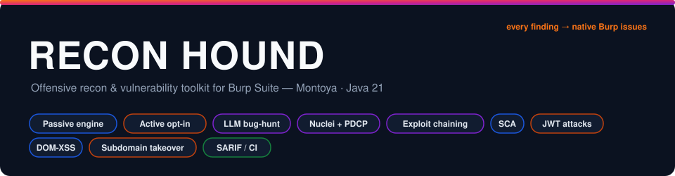
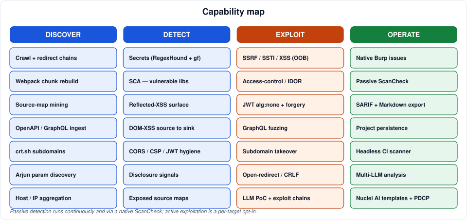
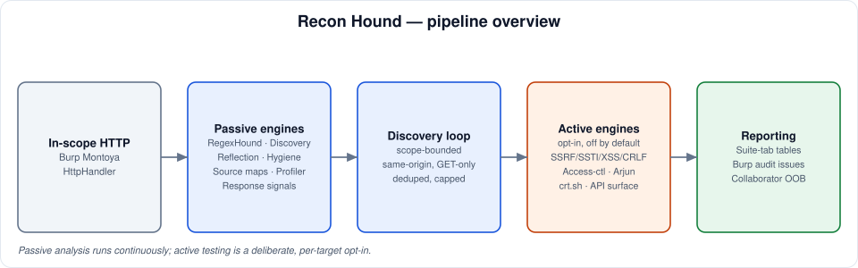
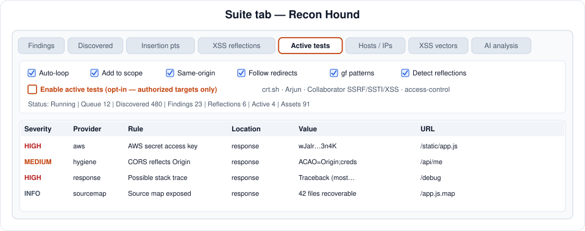
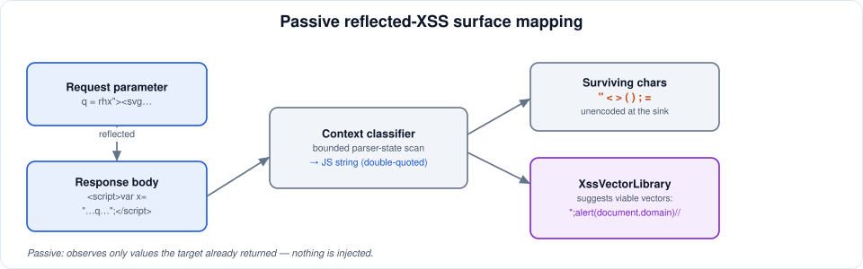
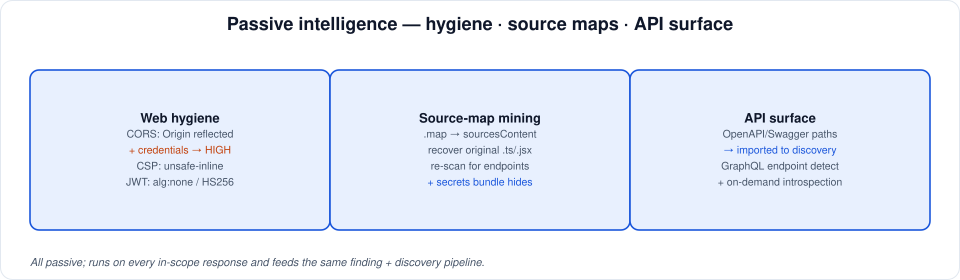
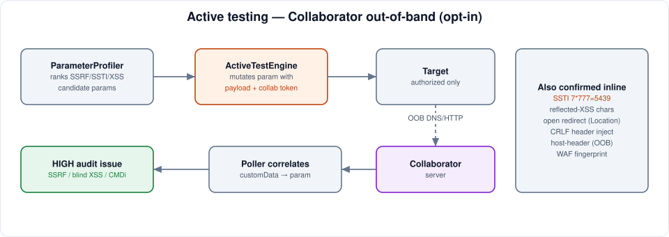
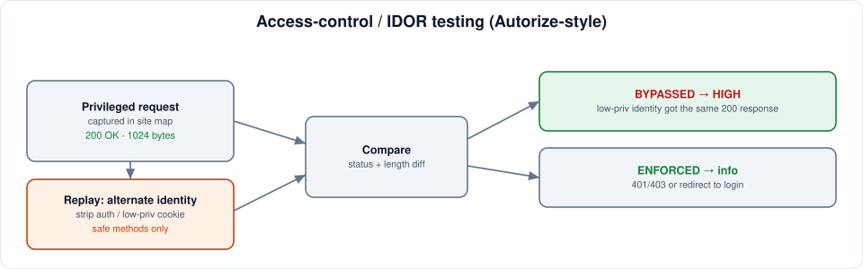
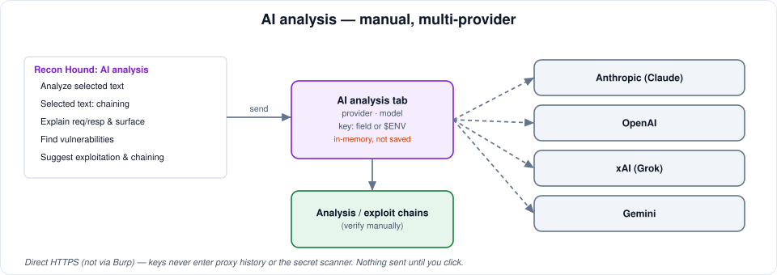
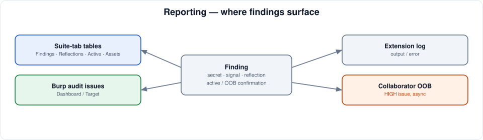

<div align="center">



### The recon-to-exploit toolkit for Burp Suite — passive intel, active testing, a multi-provider AI agent team, and Nuclei, all filing **native Burp issues**.

[](https://github.com/MKlolbullen/burpaderp/actions/workflows/ci.yml)
[](https://github.com/MKlolbullen/burpaderp/actions/workflows/release.yml)
[](https://github.com/MKlolbullen/burpaderp/releases/latest)


[**Install**](#install) · [**Capabilities**](#capability-map) · [**AI agent team**](#multi-agent-ai-team) · [**Control plane**](docs/RUN_GOVERNANCE.md) · [**CLI / CI mode**](#ci-native-scanning-no-burp-required) · [**How it works**](#what-it-does)

</div>

---

## Capability map

Recon Hound spans the full engagement — from mapping attack surface, through detecting weaknesses, to
confirming and chaining them into impact — and everything it finds is filed as a **native Burp audit
issue** (Dashboard / Target), not just a plugin tab.



|  | |
| --- | --- |
| 🔎 **Discover** | Crawl + redirect chains, **webpack-chunk reconstruction**, source-map mining, OpenAPI/GraphQL ingest, crt.sh subdomains, Arjun param discovery, host/IP inventory |
| 🩻 **Detect** | Secrets (RegexHound + `gf`), **SCA** for vulnerable JS libs, reflected-XSS surface, **DOM-XSS** source→sink, CORS/CSP/JWT hygiene, **session-cookie & CSRF** hygiene, **excessive data exposure / mass assignment**, **OAuth/OIDC** & **SAML** flaws, debug-endpoint & **BFLA** candidates, disclosure signals, exposed source maps |
| 💥 **Exploit** | Collaborator-backed **SSRF/SSTI/blind-XSS/CMDi**, native **SQLi** (error/boolean/time-based) + optional **sqlmap** hand-off, active **CORS** origin-bypass confirmation, **rate-limit** & **file-upload** probes, access-control/**IDOR**, **JWT** `alg:none` + weak-secret **forgery**, **GraphQL fuzzing**, **subdomain takeover**, open-redirect/CRLF, opt-in **encoded corpus fuzzing** |
| 🤖 **Agents** | A configurable multi-provider **AI agent team** over the finding inventory — recon → PoC drafter → adversarial verifier → leader — behind a **fail-closed human-approval gate**: it reasons, it never touches the target on its own |
| 🧠 **AI** | Five providers run together — **LLM JS bug-hunt** (PoC), cross-finding **exploit-chaining**, cross-provider **false-positive triage** (majority vote), **Nuclei** AI templates + **ProjectDiscovery cloud** scans |
| 📤 **Operate** | Native Burp issues + a passive **ScanCheck**, **SARIF + Markdown** export, per-project **persistence**, a typed Go **`reconctl` sidecar import**, and a **headless CI scanner** (`java -jar`) |

## Install

1. Grab the latest stable `burp-recon-hound-*.jar` from **[Releases](https://github.com/MKlolbullen/burpaderp/releases/latest)**. Stable releases are cut from explicit `vMAJOR.MINOR.PATCH` tags; commits to `main` are built and retained as short-lived CI artifacts.
2. Burp Suite → **Extensions → Installed → Add → Java** → select the jar.

Or build it yourself:

```bash
./gradlew clean build      # -> build/libs/burp-recon-hound-<version>.jar
```

The build accepts any installed JDK 21 or newer and always emits Java 21-compatible bytecode.

> Successor to the original Recon Loop tooling, which was stuck on the legacy Extender API under
> **Jython (Python 2)** — EOL, awkward threading, no Montoya. This is a native Java 21 extension with no
> Python runtime, running on Burp's own JVM with full access to the modern HTTP handler, site map,
> scope, scanner, and UI APIs.

## What it does





- Watches in-scope HTTP requests and responses through a Montoya `HttpHandler`.
- Scans request + response content with the Java `RegexHound` port (secrets, tokens, keys, PEM
  material, cloud credentials, provider-specific patterns, JWTs, and more, with entropy gating and
  placeholder suppression).
- Optionally loads normal `gf` JSON packs from `$GF_PATTERNS_DIR` or `~/.gf/*.json` and applies their
  regex patterns.
- Extracts URLs, API endpoints, imports, `fetch()`/Axios calls, source maps, links, forms, and
  interesting file names.
- Recognizes a broad resource set including `.js`, `.ts`, `.webchunk`, `.map`, `.conf`, `.config`,
  `.cfg`, `.env`, `.bak`, `.backup`, `.old`, `.sql`, databases, certificates/keys, archives,
  OpenAPI/GraphQL artifacts, and more.
- Adds discovered resources/directories to Burp scope when enabled.
- Queues deterministic GET requests for discovered file-like resources and endpoints, re-using the
  origin's captured auth headers.
- Follows redirect chains explicitly and scans every hop.
- Profiles Burp-parsed parameters and ranks likely injection/sink classes such as SQLi, XSS, SSTI,
  path traversal/LFI, command injection/RCE, SSRF, open redirect, and IDOR/BOLA.
- Detects response signals such as stack traces, debug disclosures, source-map references, directory
  listings, and internal-hostname hints.
- Aggregates every unique **host and IP** observed (discovered URLs, crt.sh results, and validated
  IPv4/IPv6 literals in traffic) into a dedicated **Hosts / IPs** asset inventory tab, with
  **Export…** (writes `hosts.txt` / `ips.txt` / `assets.txt` to a chosen folder) and **Add all to
  scope** (adds every collected host/IP to Burp's target scope over http and https).
- Indexes external payload `.txt` corpora without blindly auto-firing them.
- Imports contract-validated `reconctl` JSONL through a bounded, scope-rechecking handoff — no tool is
  launched and no request is sent merely by importing results. See [run governance](docs/RUN_GOVERNANCE.md).

### Passive XSS surface mapping



Recon Hound maps reflected cross-site-scripting surface passively, using techniques distilled from
the PortSwigger XSS cheat sheet:

- **Reflection-context detection** — for every in-scope response whose request carried parameters,
  the extension looks for parameter values echoed verbatim into the body and classifies the
  reflection *context*: HTML element text, single/double-quoted or unquoted attribute, URL attribute
  (`href`/`src`/`action`…), inline `<script>` string or code block, template literal, `<style>`
  block, HTML comment, or RCDATA (`<title>`/`<textarea>`).
- **Surviving-character analysis** — it reports which XSS-relevant metacharacters
  (`< > " ' ` ( ) { } ; = /`) reached the response unencoded at the reflection point, which is what
  decides whether a given class of vector is viable.
- **Context-aware vector suggestions** — `XssVectorLibrary` holds a curated, categorised set of
  cheat-sheet vectors (tag-injection, attribute breakout, `javascript:`/`data:` protocol tricks,
  JavaScript-string breakout, WAF-bypass global-object concatenation, comment-syntax and hex-escape
  obfuscation, UTF-7 / overlong-UTF-8 / HTML-entity encoding bypasses). For each observed reflection
  it surfaces only the vectors whose required characters actually survived.

The results appear in two dedicated tabs — **XSS reflections** (live, per observed sink) and
**XSS vector library** (the full catalogue as a copy-paste reference). High/medium-confidence
reflections are also raised as tentative Burp audit issues.

### Passive web-hygiene, disclosure, and API surface



More passive analysis runs on every in-scope response — all of it observing only what the target
already returned, never injecting anything:

- **Web hygiene** (`WebHygieneEngine`) — flags **CORS** misconfiguration (Origin reflection or
  `null` origin, especially with `Allow-Credentials: true`), weak **CSP** directives
  (`unsafe-inline`/`unsafe-eval`, source wildcards, missing `object-src`/`base-uri`), **JWT** defects
  (`alg:none`, brute-forceable HMAC, `kid` injection surface), **session-cookie** attribute hygiene
  (missing `HttpOnly`/`Secure`/`SameSite` on session-like cookies), and a **CSRF-protection**
  heuristic (state-changing requests carrying a session cookie with no anti-CSRF token/header).
- **Excessive data exposure & mass assignment** (`DataExposureEngine`) — walks JSON bodies for
  sensitive response fields that shouldn't be exposed, and for privileged request fields that suggest
  a mass-assignment surface.
- **OAuth/OIDC** (`OAuthEngine`) and **SAML** (`SamlEngine`) — passive flow-weakness heuristics:
  implicit/hybrid flows, missing `state`/PKCE, tokens or client secrets in the URL; and, for SAML,
  unsigned messages, weak signature algorithms, multiple-assertion (XSW) signals, and unsafe NameID
  formats, decoding both POST- and Redirect-binding messages.
- **Debug/ops endpoints & BFLA candidates** (`InterestingResourceCatalog`) — flags reachable debug
  and administration tooling, and privileged-looking paths worth an access-control check.
- **Source-map reconstruction** (`SourceMapMiner`) — recovers original source from `.map` files via
  `sourcesContent` and re-scans the recovered code for endpoints and secrets the minified bundle hid.
- **API-surface ingestion** (`ApiSurfaceEngine`) — parses **OpenAPI/Swagger** specs, imports every
  documented path into discovery, flags operations that explicitly **opt out of the spec's default
  authentication**, and detects **GraphQL** endpoints. Introspection is run on demand and its schema
  is scanned for sensitive-sounding fields/mutations.

Confirming a passive lead still means firing a context-appropriate probe against an authorised target.

### Active testing (opt-in, off by default)





An opt-in **Active testing** panel adds discovery and confirmation that require sending crafted
traffic. It is **disabled by default**, scope-checked per request, throttled, and request-capped.
Enable it only against targets you are authorised to test.

- **crt.sh subdomain enumeration** — passive OSINT against the certificate-transparency log
  (`crt.sh`, never the target). Discovered hosts feed the normal discovery/scope pipeline.
- **Arjun-style parameter discovery** — probes a built-in wordlist (extendable via
  `~/.recon-hound/params.txt`) of common parameter names against an in-scope URL and reports names
  whose canary value is reflected or that materially change the response.
- **Collaborator-backed OOB probes** — for each in-scope parameterised request: **SSRF**, **blind
  XSS**, **OS command injection**, and **host-header injection** carry a correlation tag, and a
  background poller raises a HIGH audit issue when an out-of-band DNS/HTTP interaction confirms the
  callback.
- **SQL injection** (`ActiveTestEngine`) — native **error-based** (DB error signature diffed against a
  baseline), **boolean-based blind** (true-vs-false response divergence), and **time-based blind**
  (MySQL `SLEEP`, PostgreSQL `pg_sleep`, MSSQL `WAITFOR DELAY`) detection, using a small clean payload
  set. A confirmed parameter can be handed to a locally-installed **sqlmap** (`SqlmapClient`) for
  deeper confirmation — default flags are confirmation-only; dumping/shell options only appear if you
  type them yourself.
- **SSTI** — template-arithmetic polyglots (`{{7*777}}`, `${7*777}`, `#{7*777}`, `<%=7*777%>`, …)
  confirmed only when the distinctive product `5439` is evaluated into the response.
- **Reflected-XSS confirmation** — a metacharacter canary reveals which of `< > " '` survive
  unencoded at the sink.
- **Active CORS confirmation** — replays requests with crafted attacker `Origin` headers (arbitrary
  origin, `null`, prefix/suffix bypass, scheme downgrade) and confirms a bug only when the server
  reflects the crafted origin back, HIGH when paired with `Allow-Credentials: true`.
- **Rate-limit weakness** — a small burst of identical requests at login/OTP/reset-shaped endpoints,
  flagged when no `429`/`503`, `Retry-After`, or lockout wording appears.
- **File-upload risk** (`FileUploadEngine`) — flags executable/script extensions and content-type
  mismatches in multipart uploads, and (actively) replays an upload with extension-bypass filename
  variants to see whether the server accepts and stores them.
- **Open redirect** and **CRLF/header injection** — confirmed from the `Location` header and injected
  response headers respectively; plus **WAF fingerprinting** from blocked responses.
- **Access-control / IDOR testing** (`AccessControlEngine`, Autorize-style) — replays privileged
  in-scope requests under an **alternate identity** (supplied session headers, or unauthenticated) and
  compares responses. Only **safe methods** (GET/HEAD/OPTIONS) are replayed by default.
- **JWT attacks** (`JwtAttackEngine`) — replays JWT-bearing GET/HEAD/OPTIONS requests with an
  **`alg:none`** forgery and, when the offline crack recovers the HMAC secret, a token **re-signed
  with the cracked secret and a tampered claim**. Acceptance is a HIGH end-to-end auth bypass.
- **Subdomain-takeover check** (`SubdomainTakeoverEngine`) — fetches enumerated hosts and matches
  known "unclaimed resource" fingerprints (GitHub Pages, S3, Heroku, Fastly, Shopify, …).
- **GraphQL fuzzing** (`GraphQlFuzzEngine`) — field-suggestion leakage, alias amplification, and query
  batching, each filed as a native issue.
- **Encoded corpus fuzzing** (`CorpusFuzzEngine`) — the one path that fires the bundled
  `payloads/*.txt` corpus, and only on an explicit click: it picks categories per parameter, tries
  each payload in one or more **encodings** (raw / URL / HTML-entity / Base64 and chained combinations
  via `PayloadEncoder`), **skips destructive entries** (shells, account/registry/firewall changes,
  webshell writes), and **rewrites hardcoded callback hosts** to this instance's own Collaborator.

Results appear in the **Active tests** tab and, when reproduced or stronger, as Burp audit issues.
Out-of-band findings arrive asynchronously as the Collaborator poller correlates interactions.

### Multi-agent AI team

Recon Hound can run several LLM providers together as a small "cyber team" over the finding
inventory. Enable one or more providers in the **AI analysis** tab, then click **Run agent team
(findings)**. Each provider takes a role:

| Role | Default provider | What it does |
| --- | --- | --- |
| **Recon / breadth** | Gemini | First-pass triage over the inventory; surfaces what's worth deeper work |
| **Exploit reasoner** | OpenAI | Drafts a proof-of-concept *on paper*; never executes anything |
| **Adversarial verifier** | xAI (Grok) | A *different* provider that attacks the drafter's assumptions |
| **Uncensored specialist** | Venice.ai | Proposes payloads mainstream models over-refuse — always the hardest-gated |
| **Leader / final call** | Anthropic (Claude) | Synthesises the team, ranks the real issues, and proposes next steps |

- **Leader election.** The most powerful configured member leads (an explicit leader role wins;
  otherwise the highest reasoning-effort/budget). The leader makes the final call.
- **Fail-closed human-approval gate** (`ActionGate`). The team *reasons* — it never touches the
  target on its own. Reading and drafting a PoC on paper proceed automatically; anything that would
  put packets on the wire, recreate or execute a vulnerability, or change target state is filed as a
  **human-approval escalation** in the Active tab. Unrecognised actions fail closed to "needs a human".
- **Reasoning effort.** A provider-neutral `low → max` scale maps onto each vendor's own reasoning
  knob (Anthropic effort levels, OpenAI/xAI `reasoning_effort`, Gemini thinking budget).
- **No target traffic.** The run makes LLM calls only; the leader's synthesis and every escalation
  come back to the Active tab for you to act on.

### AI analysis (optional, manual)



The **AI analysis** tab sends content you choose (recovered JavaScript, source maps, responses, or a
finding) to an LLM for review. Five providers are supported and **run together** when more than one
is enabled: **Anthropic (Claude)**, **OpenAI**, **xAI (Grok)**, **Google Gemini**, and **Venice.ai**,
each called over raw HTTPS (no vendor SDK is bundled).

- **API keys** come from an in-memory UI field or the provider's environment variable
  (`ANTHROPIC_API_KEY`, `OPENAI_API_KEY`, `XAI_API_KEY`, `GEMINI_API_KEY`, `VENICE_API_KEY`). They are
  **never persisted** to the Burp project, and requests go **direct** (not through Burp), so keys
  never enter the proxy history or trip Recon Hound's own secret scanner.
- **On-demand, nothing auto-fires.** Nothing is sent until you click a button.
- **Automated JS bug-hunt → native issues.** **Analyze in-scope JS** collects in-scope JavaScript
  (deduplicated, skipping files already reviewed) up to a per-run *file budget*, asks the LLM for
  **strict JSON**, and files every finding as a native Burp issue with a **proof-of-concept** and,
  where the model sees it, an **exploit chain**. With several providers enabled, files are
  round-robined across them concurrently for throughput.
- **Cross-finding chaining.** **Chain findings → exploit chains** sends the whole ranked finding
  inventory to the LLM and files each ranked chain as its own native Burp issue with a
  bug-bounty-ready writeup, ordered reproducible steps, and the end impact.
- **False-positive triage.** Triage reviews not-yet-triaged Findings-table rows; with more than one
  provider enabled each verdict is a **majority vote** across providers, written into the table's
  *AI Triage* column in place (the immutable native issue is never retouched).
- **AI Nuclei templates.** A **Nuclei templates (AI)** tab turns a natural-language description into a
  ready-to-run **Nuclei v3 YAML** template using whichever provider is selected — mirroring
  ProjectDiscovery's cloud `POST /v1/template/ai` with no PDCP account.
- **ProjectDiscovery cloud scan.** The same tab can launch a **cloud Nuclei scan** with a PDCP API
  key, poll it to completion, and import every match as a native Burp issue (raw request/response
  attached when it parses). The key stays in memory / `$PDCP_API_KEY`.
- **Right-click integration.** Any request/response in Proxy history, the site map, or Repeater has a
  **Recon Hound: AI analysis** submenu — *explain & attack surface*, *find vulnerabilities*, and
  *suggest exploitation & chaining* — plus selection-only variants when text is highlighted.

> ⚠️ **Privacy:** this sends target-derived data to third-party LLMs. Some bug-bounty programs
> prohibit sharing target data with third parties — only use it on data you are authorised to share.

## Reporting



Findings surface in several places:

- the Recon Hound **suite tab** tables (Findings, Discovered resources, Insertion points, XSS
  reflections, Active tests, Hosts / IPs);
- Burp's **Dashboard / Target issue list** as native audit issues — **every** finding is filed here
  through a single deduplicated reporter, so results are in Burp's own reports and never live only in
  the plugin tabs. This covers secrets, disclosure signals, reflected-parameter/XSS candidates,
  web-hygiene (CORS/CSP/JWT/cookie/CSRF), data-exposure/mass-assignment, OAuth/OIDC & SAML flaws,
  debug/BFLA candidates, exposed source maps and OpenAPI/GraphQL surface, gf-pattern hits,
  broken-access-control/IDOR, confirmed active findings (SQLi, SSRF/SSTI/XSS incl. Collaborator OOB,
  CORS, rate-limit, file-upload), vulnerable JS dependencies (SCA), JWT defects incl. offline
  weak-secret cracks, heuristic DOM-XSS, and LLM-identified JavaScript bugs (with PoC and chain).
  Informational results are filed at `INFORMATION` so nothing is dropped;
- Burp's **native scan pipeline** — Recon Hound registers a **passive scan check**, so its detectors
  also run when Burp audits traffic; the crawl and scan-check paths share one deduplicated reporter, so
  a finding is never filed twice;
- the extension **output/error log**.

The **Findings** tab can **export** to **SARIF 2.1.0** (code-scanning / CI ingestion) or **Markdown**
(a bug-bounty-ready writeup grouped by severity). Plugin state — the issue-dedupe keys, the host/IP
asset inventory, and the Findings/Hosts rows — is **persisted to the Burp project**
(`api.persistence()`), so reopening the project restores results and avoids re-filing.

## CI-native scanning (no Burp required)

The same jar is a standalone command-line scanner — its passive engines (secret detection, SCA,
heuristic DOM-XSS, exposed source maps) are Burp-free, so they run anywhere with `java -jar`:

```
java -jar burp-recon-hound.jar --fail-on high -o recon-hound.sarif https://target.example/app.js
java -jar burp-recon-hound.jar --file targets.txt --fail-on medium
```

It validates and de-duplicates HTTP(S) targets, fetches each URL, creates missing report directories,
writes a **SARIF 2.1.0** report, and exits non-zero when a finding meets `--fail-on` (`high` default /
`medium` / `low` / `info` / `none`) so it can gate a pipeline. Target files accept blank lines and
`#` comments. Invalid URLs, unknown options, missing option values, and invalid severity thresholds
fail fast with exit code 2. A ready **`Recon Scan`** GitHub Actions workflow
(`.github/workflows/recon-scan.yml`, `workflow_dispatch`) builds the jar, scans the URLs you pass, and
uploads the SARIF artifact.

## Run governance & the `reconctl` sidecar

Active behaviour is governed by an explicit control plane: a per-run request policy and hard request
**budget** gate every target-directed send, and each active run carries a scope snapshot and a
verification state rather than a loose "confirmed" flag. An optional typed Go **`reconctl`** sidecar
keeps external network scans and active fuzzing behind explicit command flags and typed input/output
contracts; Burp **re-checks scope** when importing its JSONL, and importing never launches a tool or
sends a request. See **[run governance and the sidecar handoff](docs/RUN_GOVERNANCE.md)** and the
[recon contracts](docs/RECON_CONTRACTS.md).

## Safety / scope controls

Passive analysis observes only what the target already returned. Active behaviour is:

- opt-in and **off by default**;
- Burp-scope bounded, same-origin by default, and request/redirect capped;
- gated by the per-run request policy and budget;
- and, for the AI agent team, held behind a **fail-closed human-approval gate** — the team reasons
  but never touches the target on its own.

Payload execution and XSS-vector firing are deliberately separate from discovery. The bundled corpora
contain time-based, OOB, and potentially destructive strings and are only fired by the explicit
corpus-fuzz action, which filters destructive entries and redirects callbacks to your own
Collaborator. Only test targets you are authorised to assess.

## Build

Requires Java 21. The checked-in Gradle wrapper pins and verifies the build toolchain:

```bash
./gradlew clean build
```

The build targets:

```text
net.portswigger.burp.extensions:montoya-api:2026.7
```

Load the generated JAR (`build/libs/burp-recon-hound-<version>.jar`) through **Burp Suite →
Extensions → Installed → Add → Java**.

## Payloads

The bundled `payloads/` directory contains the supplied XSS, SQLi, SSTI, LFI, and RCE corpora. At
runtime the extension looks for payloads in:

```text
$RECON_HOUND_PAYLOADS
./payloads
~/.recon-hound/payloads
~/payloads
```

They are indexed but never auto-fired — only the opt-in **corpus fuzz** action sends them, with
destructive entries filtered and callback hosts rewritten to your Collaborator.

## gf patterns

Normal gf-json files are discovered from `$GF_PATTERNS_DIR` or `~/.gf/*.json`. The lightweight loader
supports both a single `"pattern"` and an array of `"patterns"`, plus case-insensitive `flags`
containing `i`.

## Project layout

```text
src/main/java/com/victor/reconloop/
├── ReconLoopExtension.java        # BurpExtension entry point
├── ReconController.java           # HttpHandler + discovery/scan/AI orchestration
├── ReconPanel.java                # Suite tab UI
├── ReconModel.java                # Swing table models
├── ReconContextMenu.java          # right-click "AI analysis" submenu
├── ReconHoundCli.java             # headless CI scanner entry point
├── ReconScanCheck.java            # native Burp passive ScanCheck
├── IssueReporter.java             # single deduplicated audit-issue sink
│
│   # discovery / passive intel
├── DiscoveryEngine.java · InterestingResourceCatalog.java · ParameterProfiler.java
├── ResponseSignalEngine.java · GfPatternLoader.java · RegexHound.java
├── XssReflectionEngine.java · XssVectorLibrary.java · DomXssEngine.java
├── WebHygieneEngine.java · DataExposureEngine.java · OAuthEngine.java · SamlEngine.java
├── SourceMapMiner.java · WebpackMiner.java · ApiSurfaceEngine.java · DependencyVulnEngine.java
│
│   # active testing
├── ActiveTestEngine.java          # SSRF/SSTI/XSS/CMDi/CRLF/SQLi/CORS/rate-limit + Collaborator OOB
├── AccessControlEngine.java · JwtAttackEngine.java · GraphQlFuzzEngine.java
├── SubdomainTakeoverEngine.java · FileUploadEngine.java
├── CorpusFuzzEngine.java · PayloadEncoder.java · PayloadLibrary.java
├── CertificateTransparencyClient.java · ParameterDiscoveryEngine.java · SqlmapClient.java
│
│   # AI + multi-agent
├── LlmProvider.java               # Anthropic / OpenAI / xAI / Gemini / Venice
├── LlmClient.java                 # on-demand LLM analysis over raw HTTPS
├── ReasoningEffort.java           # provider-neutral low→max effort mapping
├── AgentRole.java · AgentTeam.java · AgentOrchestrator.java · ActionGate.java
├── PdcpClient.java                # ProjectDiscovery cloud Nuclei
│
│   # run governance + reporting
├── RequestPolicy.java · RequestBudget.java · ActiveRequestGateway.java
├── ScanRun.java · ScanProfile.java · RunStatus.java · ScopeSnapshot.java · VerificationState.java
├── SidecarEvent.java · SidecarEventImporter.java   # reconctl JSONL import
├── PersistedState.java · ReportExporter.java · Json.java

recon/                             # typed Go `reconctl` sidecar (contracts, router, adapters)
payloads/                          # xss / sqli / ssti / lfi / rce corpora (never auto-fired)
docs/                              # RUN_GOVERNANCE.md, RECON_CONTRACTS.md, SAFETY_ROADMAP.md, img/
```
