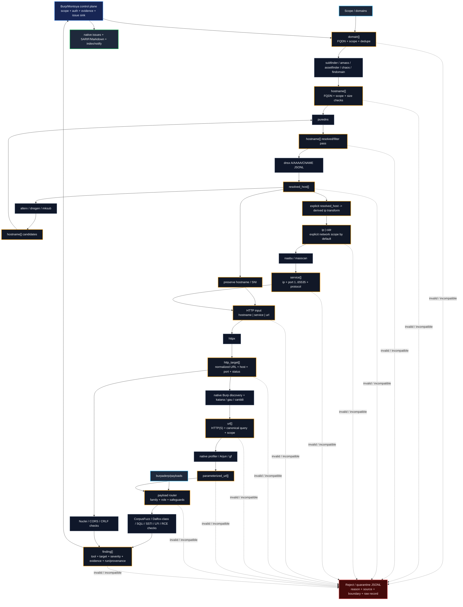

# Typed recon contracts: merged architecture

The newer contract-first diagram is the stronger architecture. The older diagram described a useful *sequence of tools*; this one defines what each stage is allowed to consume and produce, which is what makes the sequence reliable enough to become a real orchestration engine.

## Where it overlaps with Recon Hound today

| Pipeline concern | Existing Recon Hound | Contract-sidecar change |
| --- | --- | --- |
| Scope / URL normalization | Burp scope checks, URL normalization in discovery/CLI | First-class typed scope at every external boundary |
| Passive subdomains | crt.sh client | Tool contracts for subfinder/amass/assetfinder/chaos/findomain |
| DNS | host/IP inventory from observed traffic | `resolved_host` with A/AAAA/CNAME and explicit DNS adapters |
| Active permutations | not a first-class stage | alterx/dnsgen/mksub `hostname -> hostname` contracts |
| Ports/services | not modeled as a pipeline stage | explicit `ip|cidr -> service` contract for naabu/masscan |
| HTTP probing | Burp-observed traffic and PDCP/Nuclei targets | hostname/service/url -> normalized `http_target` |
| Crawling | native discovery/redirect/source-map/webpack engine | optional katana/gau/cariddi adapters feeding the same URL contract |
| Parameters | native Arjun-style discovery + profiler/gf | formal `parameterized_url` boundary + Arjun/gf adapters |
| Payloads | `PayloadLibrary` + `CorpusFuzzEngine` implicit routing | explicit payload family/role/consumer policy |
| Findings | strong: all roads already lead to `IssueReporter` | external finding records become one more source for that sink |
| Bad/incompatible output | mostly logs/ignored parser failures | reject/quarantine stream is a first-class artifact |
| Request/process limits | atomic Java request budgets; sqlmap timeout | bounded shell-free external process runner + socket limits |

## Recommended combined graph

## One deliberately hard scope decision

The `resolved_host -> ip` edge is **not** a transparent cast. A domain can resolve to a CDN, SaaS edge, shared reverse proxy, or third-party host. Treating `example.com is in scope` as `every A/AAAA address is authorised for masscan/naabu` is a scope bug.

The Go contract layer therefore tags DNS-derived IPs and rejects them at network-scanner input unless the address is inside an explicit authorised CIDR/IP range. There is an `allow-derived-ips` override for engagements where the rules of engagement explicitly permit that behavior.

## Authority boundary

Do not replace the Java extension with Go. The effective split is:

- **Java/Montoya:** captured authenticated requests, request mutation, Burp Collaborator, scope UI, response/request markers, native audit issues, project persistence, operator decisions.
- **Go sidecar:** external CLI processes, typed streaming, adapters, normalization, de-duplication, process time/size limits, and quarantine.

This prevents a second implementation of Burp-specific state while giving the high-volume recon chain the concurrency and process-control model it actually needs.

## What still needs wiring after this foundation

The first Java ↔ Go handoff is now available: `reconctl run` emits a UUID `run_id`, and Burp can import
its canonical JSONL through a bounded, scope-rechecking **Import reconctl JSONL…** action. Imported
findings flow into the existing `IssueReporter` as tentative native issues; imports never send target
traffic or silently add scope.

The contract module intentionally fails closed for output formats that are not yet machine-stable in the adapter layer. The next implementation tranche should add, in order:

1. launch sidecar stages directly from a run-scoped Burp coordinator (the current handoff deliberately imports an operator-selected JSONL artifact);
2. a run-scoped DAG compositor over the existing subfinder -> puredns -> dnsx -> httpx -> katana/gau -> Nuclei command profiles;
3. masscan document parser and rate/policy controls;
4. Dalfox/Corsy/CRLFuzz machine-output adapters only after their exact supported formats are pinned/tested;
5. durable per-run quarantine, assets, services, and findings imported into the existing Recon Hound models;
6. scan-run IDs and request-policy decisions attached to every external event and quarantine record.

The important part is that adding another tool after this point becomes an adapter + `ToolSpec` + tests, not another ad-hoc pipe in `ReconController`.
