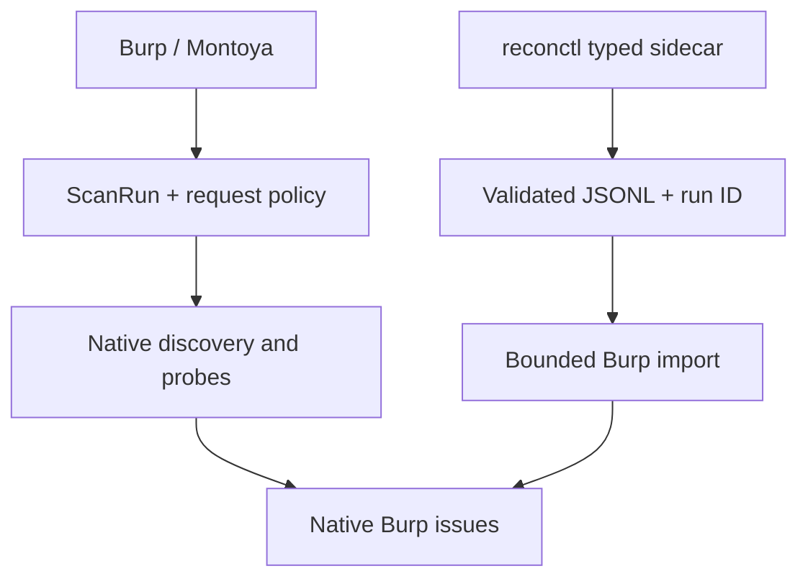

# Run governance and sidecar handoff

Recon Hound is one product with two deliberately different execution planes:



- Burp owns captured authentication, target scope, request mutation, Collaborator, evidence markers,
  issue filing, project persistence, and operator decisions.
- `reconctl` owns external binaries, typed streams, adapters, deduplication, process time/size caps,
  and quarantine.

This avoids reimplementing Burp in Go while avoiding shell-pipe orchestration inside the extension.

## Enforcement now

| Boundary | Enforced behavior |
| --- | --- |
| Go process start | `network_probe` and `active_fuzz` are off by default; `--allow-network` / `--allow-active` are explicit. |
| Go tool input/output | `ToolSpec` plus `ContractSocket` validates kinds, schema, scope, size limits, and quarantines rejected JSONL. |
| Go execution identity | `reconctl run` emits a UUID `run_id` on every accepted output record and in its run summary. |
| Burp safe HTTP paths | Discovery crawl/redirects, parameter discovery, JWT read-only replay, and subdomain-takeover checks run through `ScanRun` + `RequestPolicy` + `ActiveRequestGateway`; only in-scope `GET`/`HEAD`/`OPTIONS` requests can dispatch, and each logical run has one atomic request budget. |
| Go → Burp import | The importer bounds line/record count, parses only canonical record kinds, re-checks current Burp scope, and rejects payload/CIDR records that have no safe Burp-side materialisation. Importing never launches a process, adds scope, queues a crawl, or sends traffic. |
| Evidence lifecycle | `SIGNAL`, `CANDIDATE`, `REPRODUCED`, `CONFIRMED`, `EXPLOITABLE`, and `REJECTED` replace a lossy boolean. Legacy `true` maps conservatively to `REPRODUCED`. |

The gateway is intentionally being migrated path by path rather than claiming that legacy direct-send
paths are already covered.  Existing active engines retain their prior scope checks and budgets while
they are moved to the gateway.  New target-directed paths must start at the gateway.

## Importing sidecar output

Build the sidecar from the `recon/` module, then give each execution either a Burp `ScanRun` UUID or
let `reconctl` generate one:

```bash
cd recon
go build -o reconctl ./cmd/reconctl

printf '%s\n' '{"kind":"domain","value":"example.com"}' \
  | ./reconctl run --tool subfinder --scope-domain example.com \
      --run-id 123e4567-e89b-42d3-a456-426614174000 \
      > subfinder.jsonl
```

In Burp, choose **Import reconctl JSONL…** in the Active testing section and select the output file.
Imported domains, hosts, resolved addresses, services, URLs, parameterized URLs, and findings feed
the existing asset/discovery/parameter tables and the single `IssueReporter` sink. External findings
are filed with `TENTATIVE` confidence until reproduced in the current Burp session.

Rejected import lines are counted and a representative reason is written to the extension output log.
The Go-side quarantine stream remains the authoritative artifact for malformed tool output.
